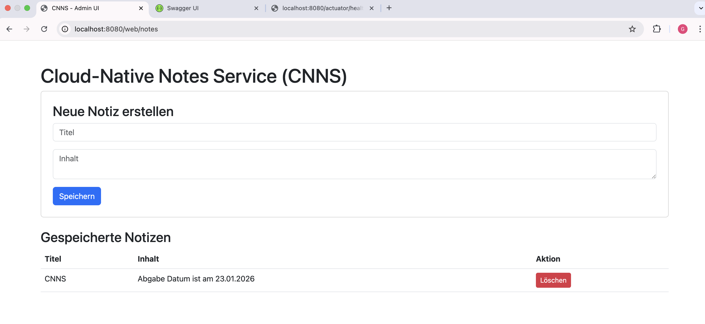
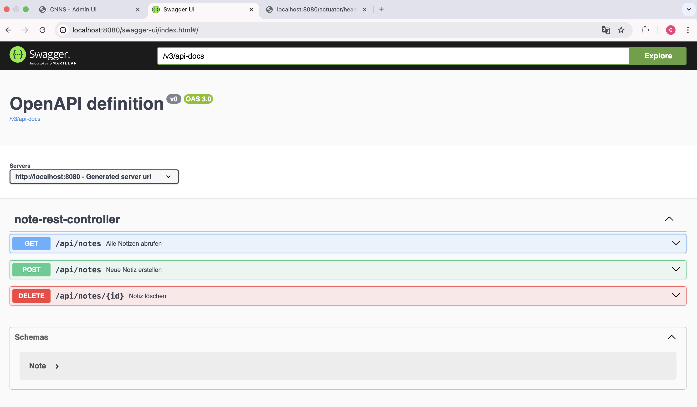
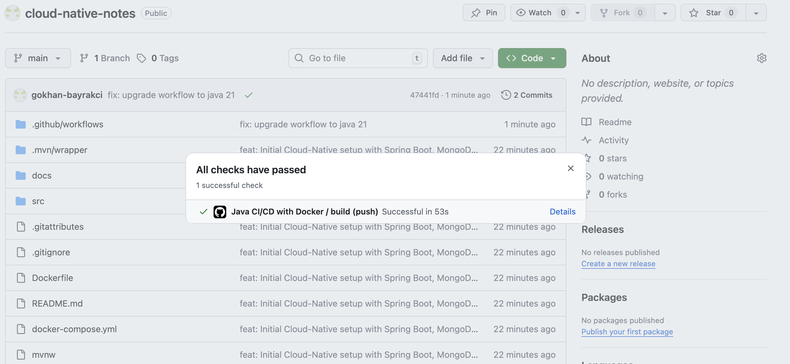

# Cloud-Native Notes Service (CNNS) 📝

Dieses Projekt wurde im Rahmen der Vorlesung **Cloud-Native Software Engineering** an der Hochschule Kaiserslautern entwickelt. Es handelt sich um einen cloud-nativen Prototyp zur Verwaltung von Notizen, basierend auf dem Spring Boot Ökosystem und einer MongoDB.

---

## 🚀 Key Features & Vorlesungsbezug

Das Projekt erfüllt die zentralen Prüfungsanforderungen durch folgende Implementierungen:

* **12-Factor App Konformität:**
    * *Config:* Konfiguration über Umgebungsvariablen (`application.yml` nutzt `${MONGODB_URI}`).
    * *Backing Services:* MongoDB wird als angehängte Ressource behandelt (Factor IV).
    * *Dev/Prod Parity:* Identische Laufzeitumgebungen durch Docker & Docker Compose (Factor X).
* **Architektur:** Implementierung einer **Layered Architecture** (Controller -> Service -> Repository) gemäß den Best Practices (Slide 008/032).
* **Persistence:** NoSQL-Datenhaltung mit **Spring Data MongoDB**.
* **Security:** Absicherung der Endpunkte mittels **Spring Security** (Basic Auth & Form Login) gemäß Slide 011.
* **API-Dokumentation:** Vollautomatische **OpenAPI/Swagger** Dokumentation (Slide 010).
* **Containerisierung:** Multi-Stage Docker-Builds für optimierte Image-Größen (Slide 004).
* **CI/CD:** Automatisierte Pipeline via **GitHub Actions** für Build und Image-Push.

---

## 🛠 Voraussetzungen

Um das Projekt lokal auszuführen, müssen folgende Tools installiert sein:

1.  **Docker & Docker Desktop:** [Download](https://www.docker.com/products/docker-desktop/)
2.  **Git:** [Download](https://git-scm.com/downloads)

---

## 💻 Installation & Schnellstart (DevProdParity)

Das gesamte System (App + Datenbank) kann dank Docker Compose ohne manuelle Installation von Java oder MongoDB gestartet werden:

1.  **Repository klonen:**
    ```bash
    git clone <DEIN_REPOSITORY_URL>
    cd CNNS
    ```

2.  **Anwendung starten:**
    ```bash
    docker-compose up --build
    ```

3.  **Zugriff:**
    Die Anwendung ist nach dem Start unter [http://localhost:8080](http://localhost:8080) erreichbar.

---

## 🔗 Wichtige Endpunkte & Login

| Dienst | URL | Beschreibung |
| :--- | :--- | :--- |
| **Admin UI** | `http://localhost:8080/web/notes` | Verwaltung der Notizen (Thymeleaf) |
| **Swagger UI** | `http://localhost:8080/swagger-ui/index.html` | Interaktive API-Dokumentation |
| **Health Status** | `http://localhost:8080/actuator/health` | Monitoring (Spring Actuator) |

**Anmeldedaten (Spring Security):**
* **Benutzername:** `admin`
* **Passwort:** `password123`

---

## 🏗 Technologie-Stack

* **Framework:** Spring Boot 3.4.x (Java 21)
* **Datenbank:** MongoDB 7.0 (Container)
* **Frontend:** Thymeleaf & Bootstrap 5
* **API:** REST mit OpenAPI 3 (SpringDoc)
* **CI/CD:** GitHub Actions (.github/workflows/main.yml)

---

## 📸 Screenshots & Dokumentation

### 1. Admin Interface (Thymeleaf)
Nachweis der funktionalen Benutzeroberfläche zur Notizverwaltung.


### 2. API-Dokumentation (Swagger)
Nachweis über die automatisierte Schnittstellenbeschreibung nach OpenAPI-Standard.


### 3. CI/CD Pipeline (GitHub Actions)
Nachweis über den erfolgreichen Build-Prozess und die Automatisierung (Green Build).


---

## ☁️ Cloud-Deployment
Das Projekt ist live erreichbar unter:
[https://cloud-native-notes.onrender.com](https://cloud-native-notes.onrender.com)

---

## 👥 Projektmitglieder
* **Gökhan Bayrakci** (@gokhan-bayrakci)